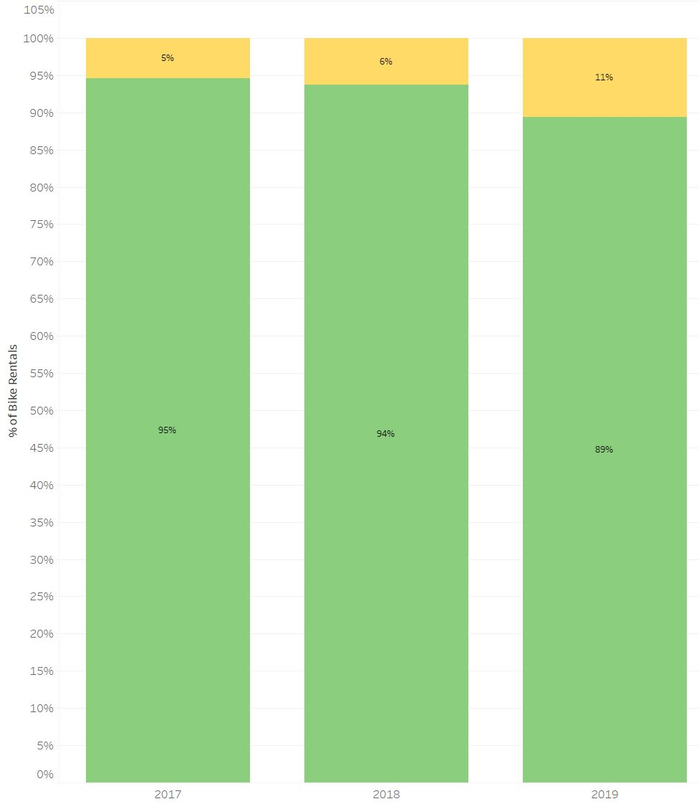

###### *A version of this analysis has been posted on Tableau-Public at:*  
[title](https://public.tableau.com/profile/karl.ramsay#!/vizhome/BikeRentalAnalysisforNYNJMetroRegion/BikeRentalAnalysis)

# Bike Rental Analysis

The following analysis examines bike rentals in the NY/NJ Metro area for 2017-2019. Close examination of the top 10 most popular Starting and Ending locations for rentals, show a strong correlation to major trains station hubs and parks. The Grove St. PATH station to Hamilton Park route and back are the most popular routes, which further supports the findings.  

## Peak Periods
Throughout the day from sunrise to sunset, there are periods of demand around early morning, midday and evening hours.  

### Summer Time

An interesting observation was that in both summer and winter, the Peak periods for bike rentals are 8am and 6pm.  
### Winter Time

In the winter months there is also alot more rentals around 5pm which is to be expected with an earlier sunset. An even more interesting trend is that there are more rentals in the winter, especially in the peak periods.This could be a factor of people wanting to avoid walking in colder temperatures, as well as in the summer months - a lot more people take vacation / travel.  

## Customer Types
While Subscriptions account for the lionshare of the bike rental market, the short-term Customer base is growing at a faster rate. This could be a result of market saturation for subscriptions or that customers find the pay-as-you-go model to be more cost-effective for their needs. Either way, this warrants further investigation  

